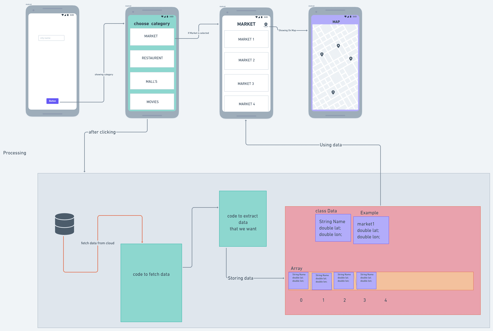

<h1 align="center"> Smart-City-Traveller </h1>

It is an Application that helps a traveler visiting a city to explore and navigate places of their choice in a very Simple way without typing and deciding which place is best and which is not.

It is an android app developed using Java and XML and Foursquare API.
- `XML` is used to make layout of the project and 
- `Java` is used is handle the backend of the app and 
- `Foursquare API` is used to provide location based experiences with diverse information about venues(Like venue name, address, latitude, longitude).

[Video Link](https://youtu.be/a3OAVr1kiqc)

## Layout

## Screenshots of the app

### Home Screen

### Input City Name

  

### Choose Category

### Venue List

### Google Map

# Requirements

### 1. Changing Foursquare Api
- Login with foursquare account and get the credentials.
- Now go to : `app\src\main\res\values\strings.xml`
- and replace `CLIENT_ID` and `CLIENT_SECRET` with your own foursquare credentials.

### 2. Change the Google Maps Api
- Get [Google Map api](https://developers.google.com/maps/documentation/android/signup)
- Now go to : `app\src\release\res\values\google_maps_api.xml`
- and replace the "google_maps_key" with your own google map api key.